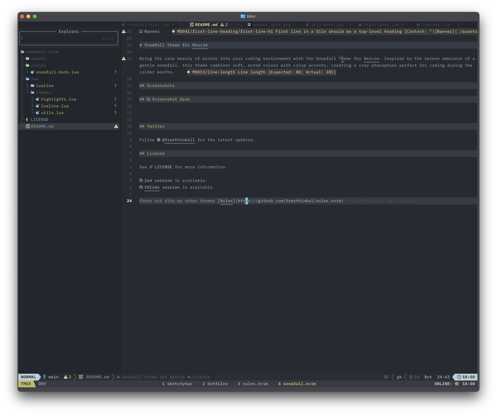

# Snowfall theme for Neovim

Bring the calm beauty of winter into your coding environment with the Snowfall Theme for Neovim. Inspired by the serene ambiance of a gentle snowfall, this theme combines soft, muted colors with crisp accents, creating a cozy atmosphere perfect for coding during the colder months.

## Screenshots

## 

<!--  -->

## Twitter

Follow [@freethinkell](https://x.com/freethinkell) for the latest updates.

## License

See [LICENSE](./LICENSE) for more information.

[Zed version](https://github.com/freethinkel/snowfall-zed) is available.
[VSCode version](https://github.com/freethinkel/snowfall) is available.

Check out also my other themes [Nules](https://github.com/freethinkel/nules.nvim)
